<!-- Typing Animation -->

 

<!-- Social Badges -->

  

<h3>Contributions</h3>

  

<h3>About Me</h3>
<table>
  <tr>
    <td valign="top"></td>
    <td valign="top"></td>
  </tr>
</table>

  

<h3>Stats & Activity</h3>
<table>
  <tr>
    <td valign="top">
      
    </td>
    <td valign="top">
      
    </td>
  </tr>
</table>

  

<!-- Spotify Widget Placeholder -->
 
<i>Click the widget to learn how to connect your own Spotify account!</i>

   

<!-- Visitor Counter -->

